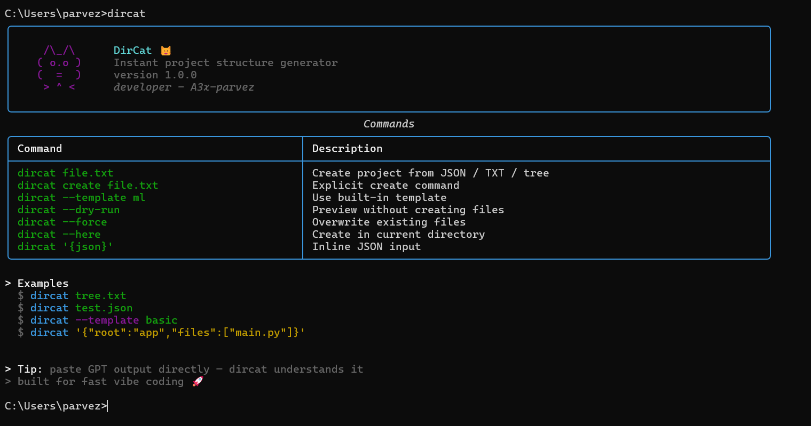

<div align="center">


# DirCat 🐱

**Instant project scaffolding from JSON, tree text, or AI output.**

[](setup.py)
[](https://www.python.org)
[](LICENSE)
[](#cli-reference)

<br/>

[📖 Docs](#usage) · [🚀 Quick Start](#quick-start) · [🐛 Report Bug](https://github.com/A3x-parvez/dircat/issues) · [✨ Request Feature](https://github.com/A3x-parvez/dircat/issues)

<br/>



</div>

---

DirCat converts structured descriptions — JSON objects, ASCII tree diagrams, or raw AI/GPT output — into a real filesystem layout. Paste a spec, get a scaffolded project in seconds.

---

## Table of Contents

- [Requirements](#requirements)
- [Installation](#installation)
- [Quick Start](#quick-start)
- [Usage](#usage)
- [Input Formats](#input-formats)
- [Templates](#templates)
- [CLI Reference](#cli-reference)
- [Project Structure](#project-structure)
- [Contributing](#contributing)
- [License](#license)

---

## Requirements

- Python 3.8 or higher
- pip
- Git

---

## Installation

### Step 1 — Clone the repository

```bash
git clone https://github.com/A3x-parvez/DirCat.git
cd DirCat
```

### Step 2 — Install the package

```bash
pip install .
```

That's it. The `dircat` command is now available globally in your terminal.

> **Tip:** Use `pip install -e .` instead if you want to edit the source and see changes reflected immediately without reinstalling.

### Verify the install

```bash
dircat
``` 
```bash
dircat --help
```

You should see the DirCat home UI with the list of available commands.

---

## Quick Start

Once installed, run `dircat` from anywhere:

```bash
# Scaffold from a JSON file
dircat structure.json

# Scaffold from a TXT file
dircat structure.txt

# Use a built-in template
dircat --template basic

# Inline JSON — no file needed
dircat '{"root":"app","files":["main.py","requirements.txt"]}'

# Preview without creating anything
dircat --dry-run structure.json
```

---

## Usage

### From a file

Create a `structure.json` (or `.txt`) and pass it to DirCat:

```bash
dircat structure.json
```

### From inline JSON

Pass a JSON string directly as an argument — no file required:

```bash
dircat '{"root":"myapp","folders":["src","tests"],"files":["README.md","src/main.py"]}'
```

### Using a template

Use one of the built-in templates to scaffold a standard layout:

```bash
dircat --template basic
dircat --template ml
```

### Dry run (preview only)

See exactly what will be created before any files are written:

```bash
dircat --dry-run structure.json #json file
dircat --dry-run structure.txt #txt file
```

### Create in the current directory

By default DirCat creates the project inside a named root folder. Use `--here` to create directly in the current directory:

```bash
dircat structure.json --here
```

### Overwrite existing files

```bash
dircat structure.json --force
```

### Quiet mode

Suppress the summary UI and only show errors:

```bash
dircat structure.json --quiet
```

---

## Input Formats

DirCat accepts multiple input formats and auto-detects them at runtime.
Input can be a `.json` file, a `.txt` file, or an inline string — no strict file type required.


### JSON object

```json
{
  "root": "myapp",
  "folders": ["src", "tests"],
  "files": ["README.md", "src/__init__.py", "src/main.py"]
}
```

```bash
dircat structure.json   # or structure.txt — both work
```


### JSON with file contents

Files can map to string content instead of being created empty:

```json
{
  "root": "service",
  "files": {
    "README.md": "# Service",
    "src/app.py": "print('hello')"
  }
}
```

### ASCII tree

```
myapp/
├── src/
│   └── main.py
├── tests/
└── README.md
```

```bash
dircat tree.txt
```

DirCat detects `├──` / `└──` characters and converts the tree into a valid structure automatically.


### AI / GPT output

Paste output from GPT or Claude directly — DirCat can handle common markdown-wrapped JSON or tree structures and extract usable input automatically.

---

## Templates

Built-in templates live in [`dircat/templates/`](dircat/templates). List all available templates:

```bash
python -m dircat.cli template --list
```

Use a template:

```bash
dircat --template basic
dircat --template ml
```

To add your own, drop a valid JSON file into `dircat/templates/<name>.json` and it will be auto-discovered.

---

## CLI Reference

| Command / Flag | Description |
|---|---|
| `dircat <input>` | Create project from file, inline JSON, or tree text |
| `--template <n>` | Use a built-in template |
| `--dry-run` | Preview actions without writing to disk |
| `--force` | Overwrite existing files |
| `--here` | Create in the current directory |
| `--quiet` | Suppress summary output |
| `template --list` | List available built-in templates |
| `version` | Print DirCat version |

> If the first argument is not a recognized subcommand, DirCat assumes `create` — so `dircat tree.txt` just works.

---

## Project Structure

```
dircat/
├── cli.py        # Argument parsing and CLI entry point
├── core.py       # Filesystem creation logic
├── utils.py      # Input parsing: JSON, tree, AI output normalization
├── ui.py         # Terminal UI components (rich)
└── templates/
    ├── basic.json
    └── ml.json
```

---

## Contributing

Contributions are welcome! Here's how to get started:

1. Fork the repository and create a feature branch
2. Clone your fork and install in editable mode:
   ```bash
   git clone https://github.com/your-username/dircat.git
   cd dircat
   pip install -e .
   ```
3. Make your changes and add tests for new behavior
4. Open a pull request with a clear description

Please keep `VERSION` in `dircat/cli.py` in sync with any release tags.

---

## License

This project does not yet have a license file. Consider adding an [MIT License](https://choosealicense.com/licenses/mit/) to clarify usage terms.

---

<div align="center">

Made with ❤️ by **A3x-parvez**

[](https://github.com/A3x-parvez)
[](https://rijwanool-karim.vercel.app)
[](https://linkedin.com/in/rijwanool-karim)

</div>