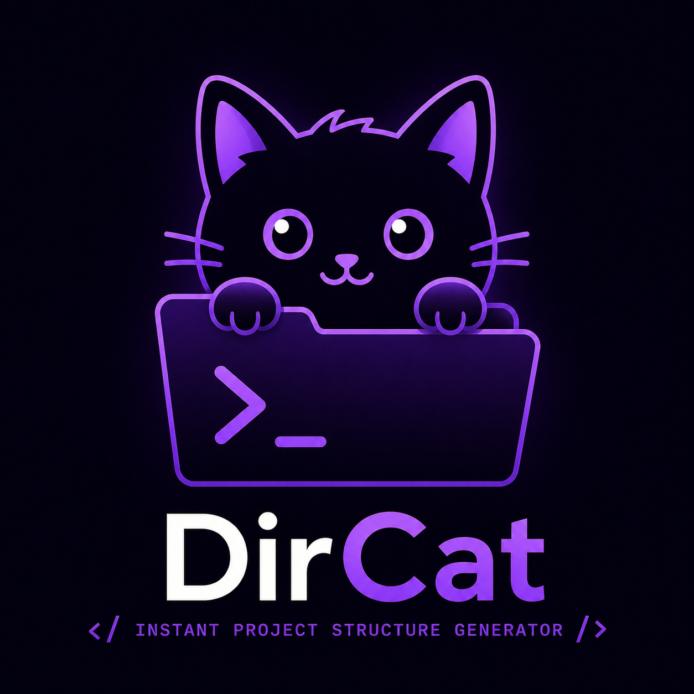

<div align="center">



# DirCat 🐱

**Instant project scaffolding from JSON, tree text, or AI output.**

[](setup.py)
[](https://www.python.org)
[](LICENSE)
[](#cli-reference)

<br/>

[📖 Docs](#usage) · [🚀 Quick Start](#quick-start) · [🐛 Report Bug](https://github.com/A3x-parvez/dircat/issues) · [✨ Request Feature](https://github.com/A3x-parvez/dircat/issues)

</div>

---

DirCat converts structured descriptions — JSON objects, ASCII tree diagrams, or raw AI/GPT output — into a real filesystem layout. Paste a spec, get a scaffolded project in seconds.

---

## Table of Contents

- [Features](#features)
- [Installation](#installation)
- [Quick Start](#quick-start)
- [Usage](#usage)
- [Input Formats](#input-formats)
- [Templates](#templates)
- [CLI Reference](#cli-reference)
- [Project Structure](#project-structure)
- [Contributing](#contributing)
- [License](#license)

---

## Features

- **Multiple input formats** — JSON files, inline JSON strings, ASCII tree diagrams, and messy AI output
- **Safe by default** — `--dry-run` previews all actions before touching the filesystem; `--force` to overwrite
- **Built-in templates** — scaffold common project layouts instantly with `--template <n>`
- **AI-friendly** — paste GPT/Claude output directly; DirCat strips markdown fences and extracts valid structure
- **Rich terminal UI** — clear output with a summary of folders and files created

---

## Installation

Install from source (requires Python 3.8+):

```bash
git clone https://github.com/A3x-parvez/dircat.git
cd dircat
pip install -e .
```

> **Runtime dependency:** [`rich`](https://github.com/Textualize/rich) is installed automatically.

---

## Quick Start

```bash
# Scaffold from a JSON file
dircat structure.json

# Use a built-in template
dircat --template basic

# Inline JSON
dircat '{"root":"app","files":["main.py","requirements.txt"]}'

# Preview without creating anything
dircat --dry-run structure.json
```

---

## Usage

### From a file

```bash
dircat structure.json
```

### From inline JSON

```bash
dircat '{"root":"myapp","folders":["src","tests"],"files":["README.md","src/main.py"]}'
```

### Using a template

```bash
dircat --template basic
dircat --template ml
```

### Dry run (preview only)

```bash
dircat --dry-run structure.json
```

### Create in the current directory

```bash
dircat structure.json --here
```

### Quiet mode

```bash
dircat structure.json --quiet
```

---

## Input Formats

DirCat accepts three input formats, auto-detected at runtime.

### JSON object

```json
{
  "root": "myapp",
  "folders": ["src", "tests"],
  "files": ["README.md", "src/__init__.py", "src/main.py"]
}
```

### JSON with file contents

Files can map to string content instead of being created empty:

```json
{
  "root": "service",
  "files": {
    "README.md": "# Service",
    "src/app.py": "print('hello')"
  }
}
```

### ASCII tree

```
myapp/
├── src/
│   └── main.py
├── tests/
└── README.md
```

DirCat detects `├──` / `└──` characters and parses the tree into the equivalent JSON config automatically.

---

## Templates

Built-in templates live in [`dircat/templates/`](dircat/templates). List available templates:

```bash
python -m dircat.cli template --list
```

To add your own template, drop a valid JSON file into `dircat/templates/<n>.json`.

---

## CLI Reference

| Command / Flag | Description |
|---|---|
| `dircat <input>` | Create project from file, inline JSON, or tree text |
| `--template <n>` | Use a built-in template |
| `--dry-run` | Preview actions without writing to disk |
| `--force` | Overwrite existing files |
| `--here` | Create in the current directory |
| `--quiet` | Suppress summary output |
| `template --list` | List available built-in templates |
| `version` | Print DirCat version |

> If the first argument is not a recognized subcommand, DirCat assumes `create` — so `dircat tree.txt` just works.

---

## Project Structure

```
dircat/
├── cli.py        # Argument parsing and CLI entry point
├── core.py       # Filesystem creation logic
├── utils.py      # Input parsing: JSON, tree, AI output normalization
├── ui.py         # Terminal UI components (rich)
└── templates/
    ├── basic.json
    └── ml.json
```

---

## Contributing

Contributions are welcome! Here's how to get started:

1. Fork the repository and create a feature branch
2. Install in editable mode: `pip install -e .`
3. Make your changes and add tests for new behavior
4. Open a pull request with a clear description

```bash
# Verify your setup
pip install -e .
python -m dircat.cli --help
```

Please keep `VERSION` in `dircat/cli.py` in sync with any release tags.

---

## License

This project does not yet have a license file. Consider adding an [MIT License](https://choosealicense.com/licenses/mit/) to clarify usage terms.

---

<div align="center">

Made with ❤️ by **A3x-parvez**

[](https://github.com/A3x-parvez)
[](https://rijwanool-karim.vercel.app)
[](https://linkedin.com/in/rijwanool-karim)

</div>